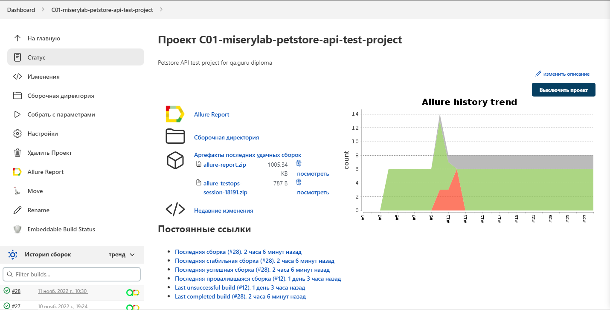
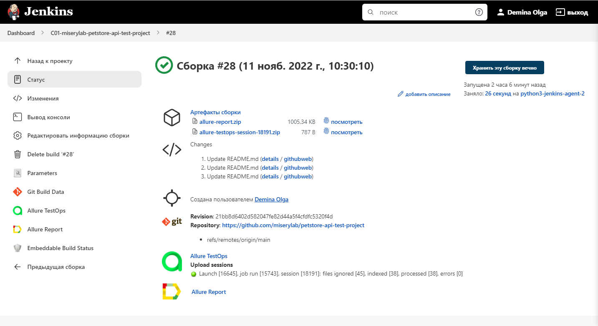
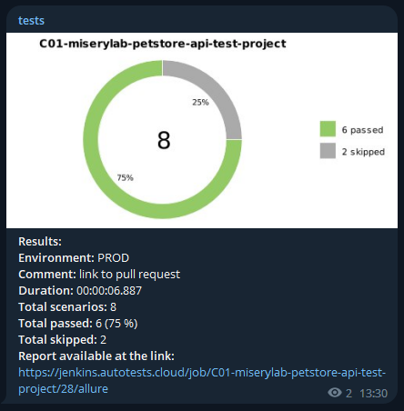
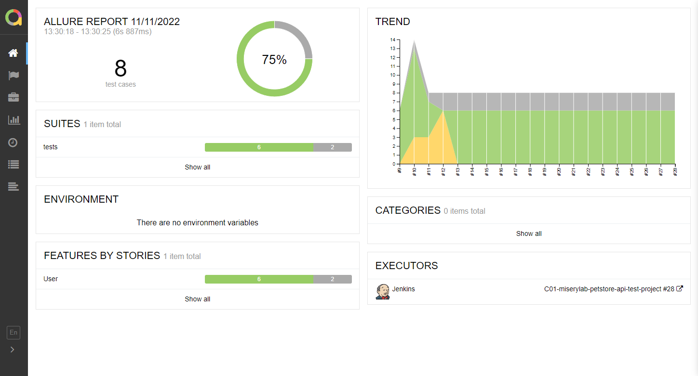
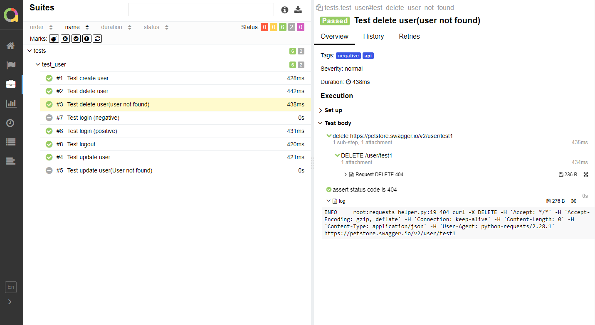
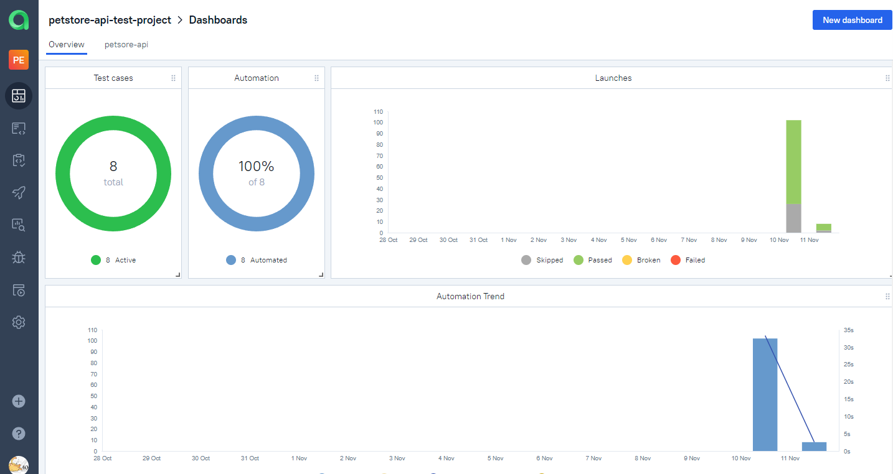
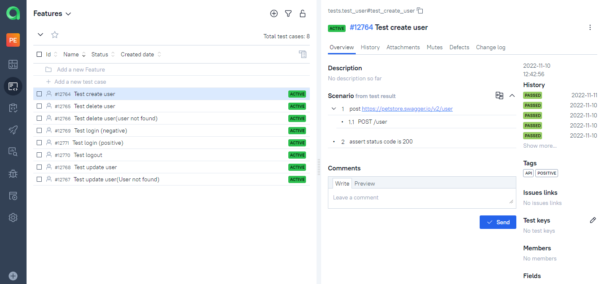
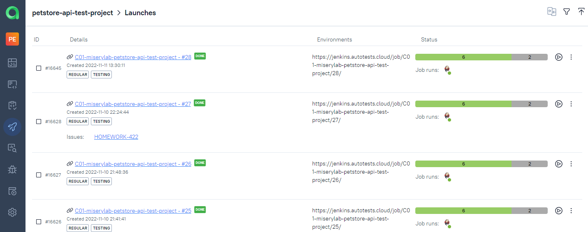
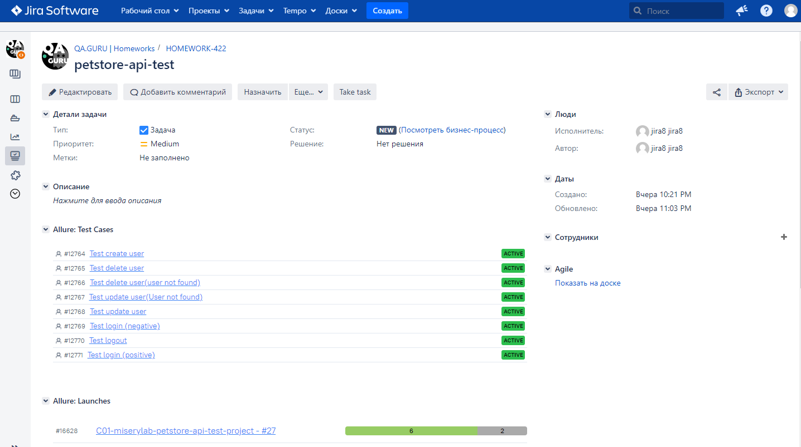

# Test automation project for [Petstore](https://petstore.swagger.io/)

# <a name="TableOfContents">Table of contents</a>
+ [Description](#Description)
+ [Tools and technologies](#Technology)
+ [How to run](#HowToRun)
    + [Run in Jenkins](#RunInJenkins)
+ [Telegram Notifications](#TelegramNotifications)
+ [Test results report in Allure Report](#AllureReport)
+ [Allure TestOps integration](#AllureTestOps)
+ [Jira integration](#Jira)


# <a name="Description">Description</a>
The test project consists of API tests.

[Back to the table of contents ⬆](#TableOfContents)

# <a name="Technology">Tools and a technologies</a>
<p  align="center">
  
  
  
  
  
  
  
</p>

The autotests in this project are written in `Python` using `Pytest` framework.\
`Jenkins` - CI/CD for running tests remotely.\
`Allure Report` - for test results visualisation.\
`Telegram Bot` - for test results notifications.\
`Allure TestOps` - as Test Management System.

[Back to the table of contents ⬆](#TableOfContents)

# <a name="HowToRun">How to run</a>

To run locally and in Jenkins the following command is used:
```bash
pytest .
```

[Back to the table of contents ⬆](#TableOfContents)


## <a name="RunInJenkins">Run in [Jenkins](https://jenkins.autotests.cloud/job/C01-miserylab-petstore-api-test-project/)</a>
Main page of the build:
<p  align="center">
  
</p>


After the build is done the test results are available in:
>- <code><strong>*Allure Report*</strong></code>
>- <code><strong>*Allure TestOps*</strong></code>

<p  align="center">
  
</p>

[Back to the table of contents ⬆](#TableOfContents)


# <a name="TelegramNotifications">Telegram Notifications</a>
Telegram bot sends a brief report to a specified telegram chat by results of each build.
<p  align="center">

</p>

[Back to the table of contents ⬆](#TableOfContents)

# <a name="AllureReport">Test results report in [Allure Report](https://jenkins.autotests.cloud/job/C01-miserylab-petstore-api-test-project/28/allure/)</a>


<p align="center">
  
</p>

<p align="center">
  
</p>


[Back to the table of contents ⬆](#TableOfContents)

# <a name="AllureTestOps">[Allure TestOps](https://allure.autotests.cloud/project/1655/dashboards) integration</a>
> The link can be accessed only by authorized users.

## <a name="AllureTestOpsProject">Project in Allure TestOps</a>


<p align="center">
  
</p>

<p align="center">
  
</p>

<p align="center">
  
</p>


[Back to the table of contents ⬆](#TableOfContents)

# <a name="Jira">[Jira](https://jira.autotests.cloud/browse/HOMEWORK-422) integration</a>
> The link can be accessed only by authorized users.
<p align="center">
  
</p>

[Back to the table of contents ⬆](#TableOfContents)


